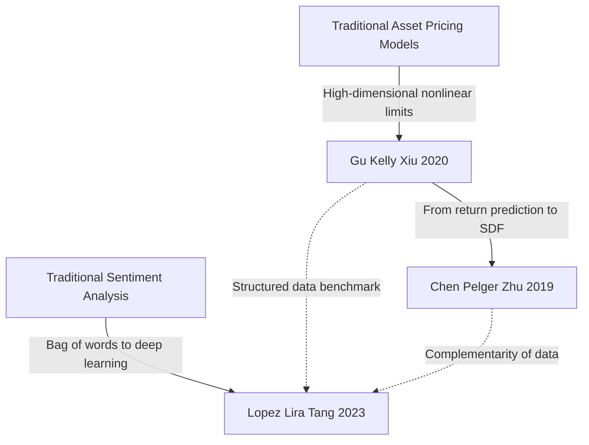

# Quant-and-ML
Quant and ML Papers Code

```mermaid
graph TD
    A[Traditional Asset Pricing Models]
    B[Gu Kelly Xiu 2020]
    C[Chen Pelger Zhu 2019]
    D[Traditional Sentiment Analysis]
    E[Lopez Lira Tang 2023]

    A -->|High-dimensional nonlinear limits| B
    B -->|From return prediction to SDF| C
    D -->|Bag of words to deep learning| E
    B -.->|Structured data benchmark| E
    C -.->|Complementarity of data| E
```
